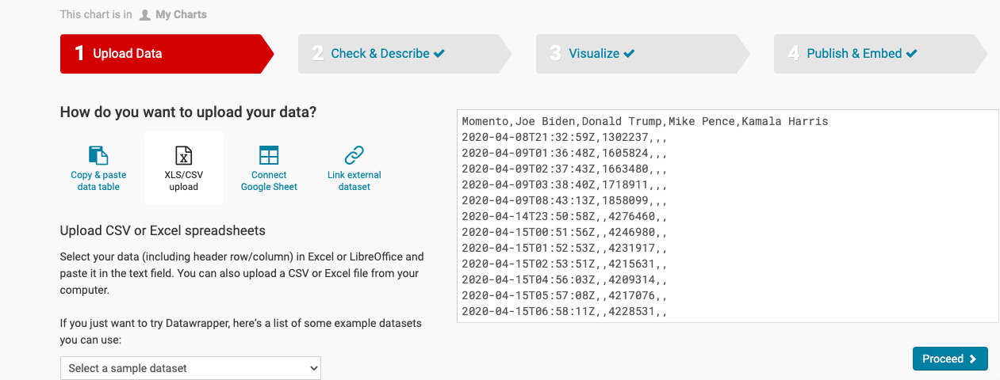
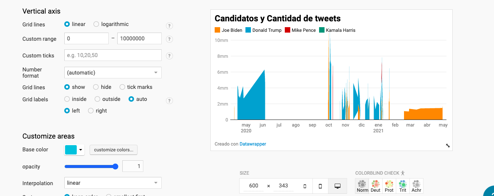
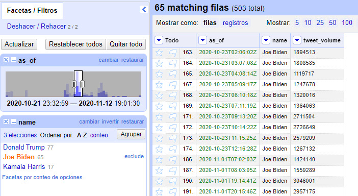

# Justificación y AD3

## La visualización del gráfico de actividad-dirigida-3

En primer lugar, presento la visualización del gráfico lo que realicé con la herramienta Datawrapper: 

### Explicaciones de la elección del gráfico

Elegí este gráfico porque se combina muy bien la cantidad de los tweets y los candidatos, ya que es un base de datos complicados juntos con otro dato que es la fecha; Utilicé diferentes colores para diferenciar los cuatro diferentes candidatos para que la visualización que sea más directa.

Realicé este gráfico a través de la herramienta Datawrapper, subí el archivo de datos de formato csv. después de limpiar los datos con Open Refine.

#### Primer paso:subir el archivo de dato de formato csv. 

#### Segundo paso: elegir el gráfico adecuado 

#### Tercer paso: cambiar algunos ajustes

En este caso, he cambiado el *custom range* de Vertical axis, que es [0 - 10,000,000].
Luego, he cambiado el color de la visualización para que cuatro diferenes colores presentan los cuatro candidatos distintos. 

## La limpieza con Open Refine
### Al siguiente es la justificación de la operación de Open Refine

El archivo csv que subí al Datawrapper, hice una limpieza de datos previamente con el Open Refine. 

#### Las transformaciones 
He tranforamdo la colomba de fecha según: editar celdas - transformaciones comunes - a fecha
Hice ligual con los numeros de tweets, según: editar celdas - transformaciones comunes - a número

#### Renombrar la faceta: 
Renombré las facetas según: editar colomnas - renombrar esta columna 

#### Fitro y Transponer columnas
Luego añadí el fitro, compruebé los datos y transponer/crear columnas de cuatro candidatos.

