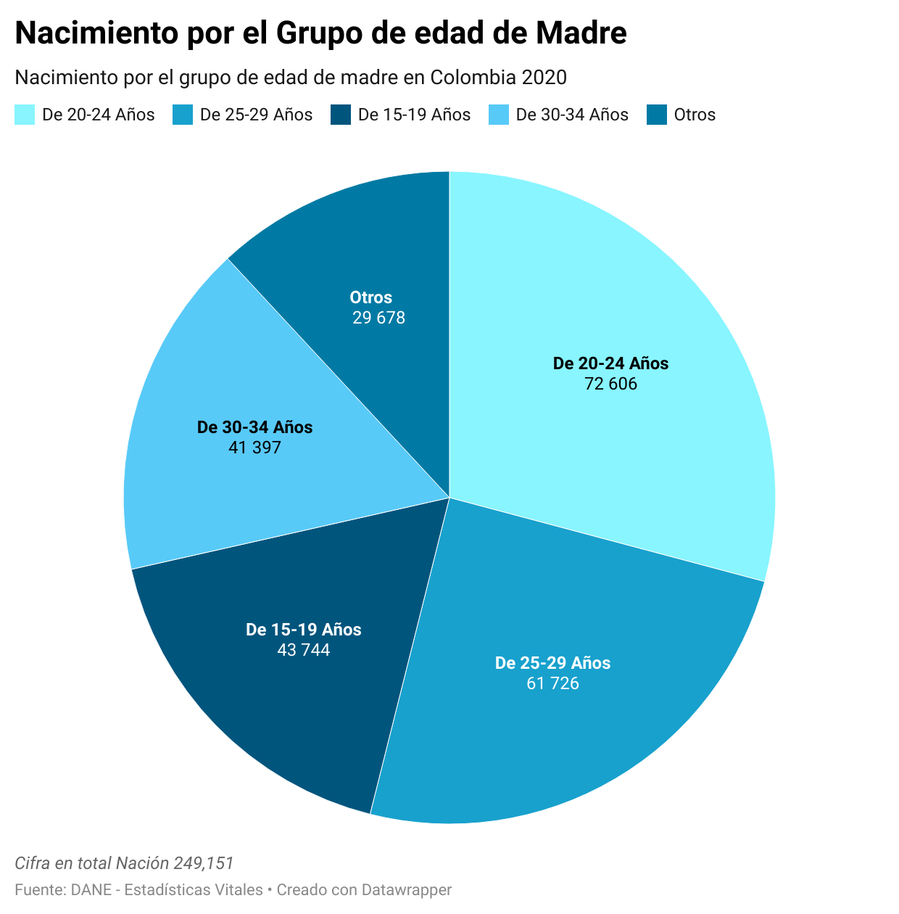

# El embarazo de adolescentes en Colombia 

**Los embarazos de adolescentes en Colombia** son un problema social. De acuerdo con la definición de la [Organización Mundial de la Salud](https://www.who.int/es/health-topics/adolescent-health#tab=tab_1) la edad de la adolescencia está comprendida **entre los 10 y los 19 años**. Analizaremos la situación de los embarazos en el rango de edad **entre 15 y 19 años**, aunque no hay que obviar que **1.721 niñas** de entre **10 y 14 años** quedaron embarazadas en el año 2020.

## Contraste respecto a España
Hasta el 28 de octubre de 2021 la tasa de **fertilidad en adolescentes para Colombia** ha sido de 64.313, según los [datos correspondientes a 2019](https://databank.bancomundial.org/reports.aspx?source=2&series=SP.ADO.TFRT&country=COL) del [Banco Mundial](https://www.bancomundial.org/es/home) Mientras tanto, la cifra de **España es 72.558** (nacimientos por cada 1.000 mujeres entre **15 y 19** años de edad).

### El siguiente se encuentra el gráfico de la taza de fertilidad 

 

En Colombia, desde 1960 la tasa de fertilidad en adolescentes (aunque con un leve repunte en los años 90) ha bajado constantemente. A pesar de ello, los valores siguen resultando excesivos si los comparamos con los de España: la diferencia es enorme, y puede llegar a ser **10 veces superior.**

 

## Comparativa por edades

Según los datos del [Departamento Administrativo Nacional de Estadística de Colombia](https://www.dane.gov.co/index.php/estadisticas-por-tema/salud/nacimientos-y-defunciones/nacimientos/nacimientos-2020) en el año 2020 el número de nacimientos fue de 512.185 en total. De entre los cuales, **1.721** fueron de mujeres con edades entre *10 y 14 años*, y **43.744** de *15 a 19 años*.

### El siguiente se muestra el gráfico de los nacimientos por grupo de edad en Colombia de 2020:

 

El porcentaje en edades de **15 a 19 años** fue del *17,6%*, el de **10 a 14 años** fue del *0,7%*, y el porcentaje del embarazo en adolescentes, del **18,3%.**

Con respecto a **los embarazos en las edades entre 15 y 19 años**, hemos analizado la situación de las madres, tanto residencial como a **nivel educativo**. Una gran parte de ellas reside en zonas rurales, y además no han recibido una educación suficiente.

 

Este otro gráfico muestra que de entre las mujeres de 15 a 19 años, el 17,49% solo han recibido **educación preescolar**; el 25,17% han recibido **educación básica primaria**; el 33,75% han recibido **educación básica secundaria**; el 15,91% no han recibido *ningún educación*; solo el 2,48% han recibido **educación tecnológica profesional**; apenas el 0,71% han recibido **educación profesional**; y *nadie ha alcanzado una educación especializada ni tampoco un máster.*

Es evidente que las mujeres que quedan embarazadas a edades tempranas no logran un alto nivel formativo, y podríamos imaginar que *el nivel educativo de la madre y el embarazo en adolescentes es **inversamente proporcional.*

## Razones y consecuencias

“El embarazo en adolescentes es un **problema social**, con consecuencias tales como: *conflictos familiares, abandono escolar, cambio de proyectos vitales, discriminación, matrimonio servil o a temprana edad, reducción de ingresos y pobreza.”*

[Unicef](https://www.unicef.org), por su parte, señala que este aumento de embarazos adolescentes y de menores de edad puede estar directamente relacionado con la pandemia que vive el mundo.

Una de las razones principales del embarazo en adolescentes es **la falta de educación, información y orientación sobre la sexualidad.** No reciben información desde los colegios ni los familiares por ser tabúes, no tienen suficientes conocimientos básicos sobre la sexualidad, no toman medidas anticonceptivas o adecuadas y no son conscientes de que el embarazo temprano podría afectar a su futuro.

Deben tener en cuenta que las consecuencias de los embarazos son muchas e irreparables en algunas ocasiones, siempre hay un impacto muy grande tanto para el desarrollo personal como el social. Una serie de problemas como la salud, el riesgo vital para las mujeres en cuanto dan a luz, enfermedades infecciosas, la falta de atención y educación de los niños nacidos, etc.

La **educación de la sexualidad** para los adolescentes ya es un tema importante, necesario y urgente en el país. Por lo tanto, el gobierno, las organizaciones o las fundaciones deberían asumir la responsabilidad de fomentarla.

 
 
 

Fuente:
 
Databank, La taza de fertilidad en adolescentes en Colombia, mayo de 2021
 
https://datos.bancomundial.org/indicator/SP.ADO.TFRT
 
DANE-Esdatística vital, Nacimientos 2020 - Preliminar, 2021
 
https://www.dane.gov.co/index.php/estadisticas-por-tema/salud/nacimientos-y-defunciones/nacimientos/nacimientos-2020

 
