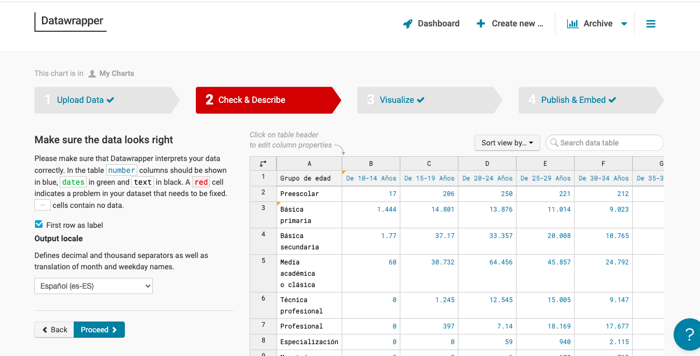
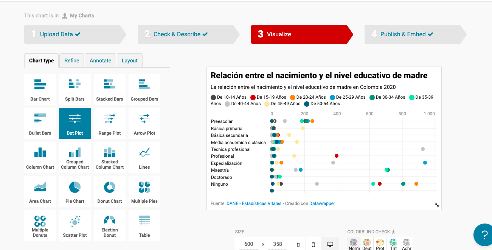
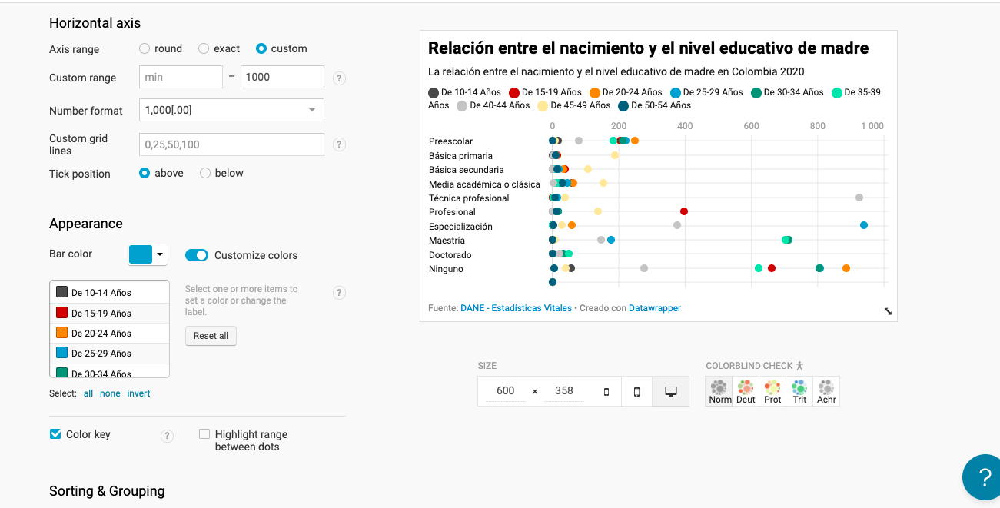
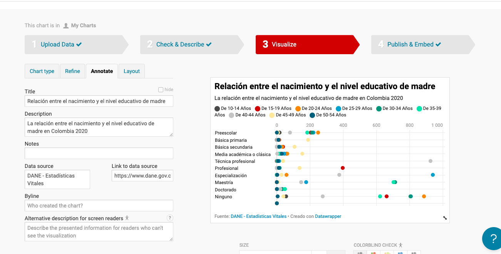
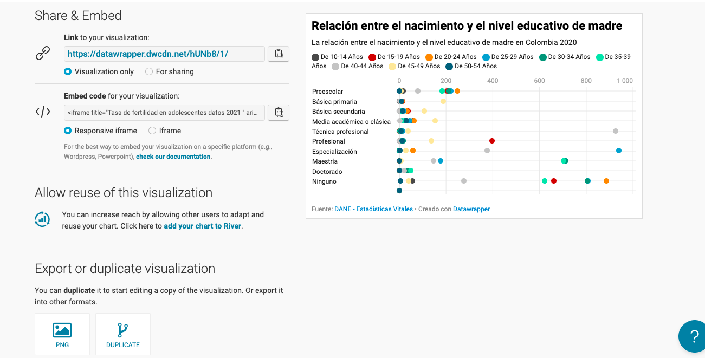
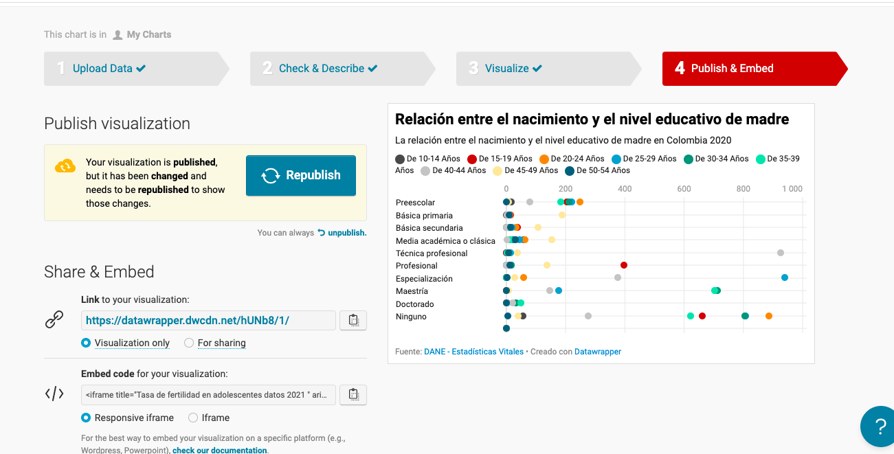

# Justificación de la actividad-dirigada-4

## En este archivo se presenta la justificación del proceso de la visualización de la actividad-dirigida-4

En total he hecho tres gráficos para la actividad dirigida 4, como es el mismo proceso, justifico un de los tres gráficos que realicé con la herramiente Datawrapper, el de *La relación entre el nacimiento y el nivel educativo de madre.*

### Subir el archivo 
Deacergué los datos en DANE, después de hacer una limpieza en OpenRefine, subí el archivo limpiado en Datawrapper.

 

### Revisa de nuevo
Aunque ya había hecho una limpieza previo en OpenRefina, al subir el archivo en Datawrapper, he hecho una revisión también, los textos en negro y los números en zaul, si hay algun error, se ve en rojo; en mi caso, no había contenidos en rojo, pero he hecho una transponer en columnas, para adecuar mejor con el gráfico posteriormente. 

 

### Elegir gráfico 
En principio me propuso automáticamente el gráfico *Lines*, luego cambié al *Dot Plot*, porque creo que es más adecuado.

 

### *Refine*
En *Refine*, he cambiado el rango de *Custom range* hasta 1000 para que se ve mejor el gráfico. Luego he añadido diferentes colores para distintos rango de edad, también, he selecionado el *Color key*, para que se ve los colores correspendientes a los rangos de edad en el gráfico.

 

### Títulos del gráfico y otras inforamciones
Después he añadido el título del gráfico y otras informaciones complementarias, también he puesto el fuente de los datos y el enlace.

 

### Descargar la foto
Una vez que la visualización del gráfico ya se ve bien y completo, descargué la foto de formato png.

 

### Publicar el gráfico 
Después de descargar el gráfico en formato png, por curiosidad, también hice publicar.

 

 
 

