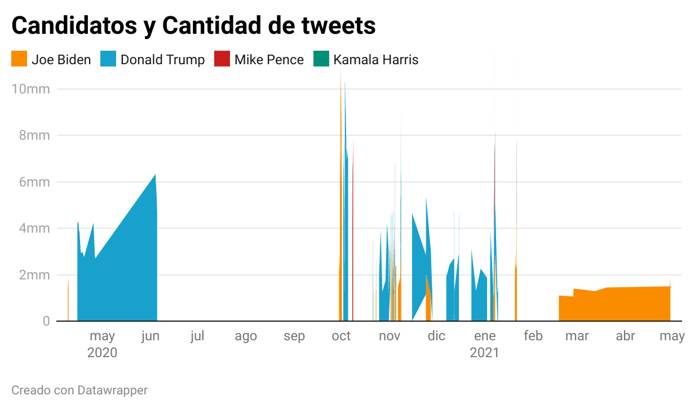
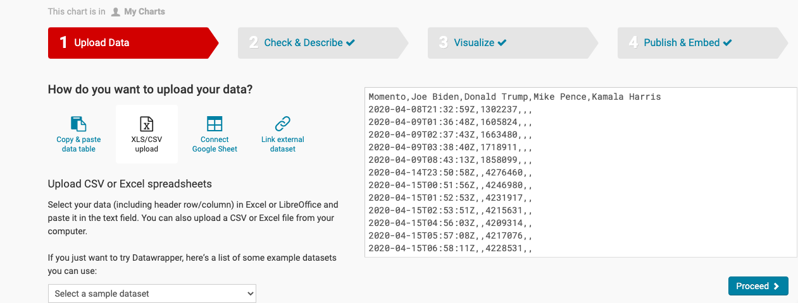
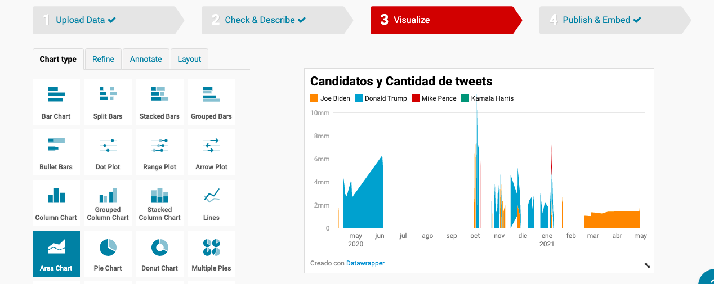
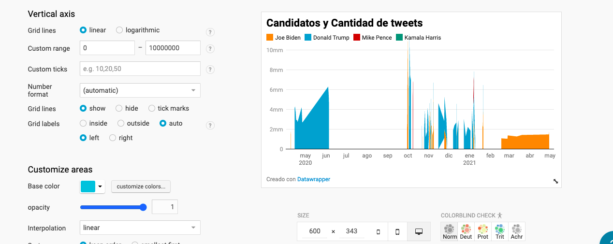
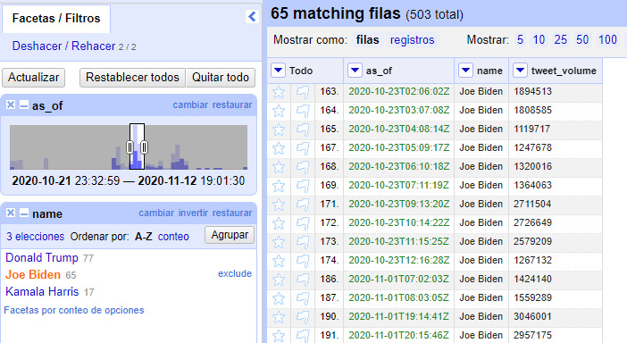
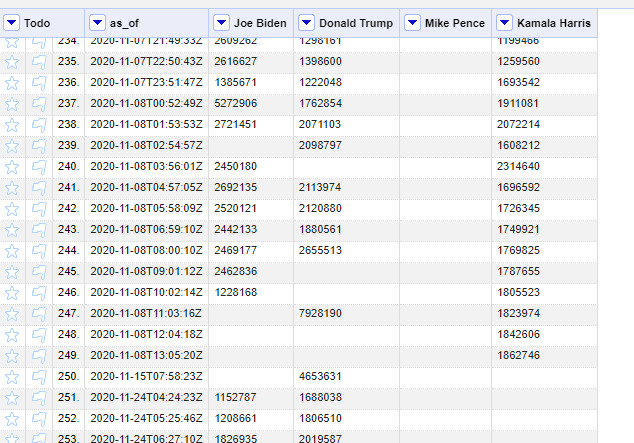
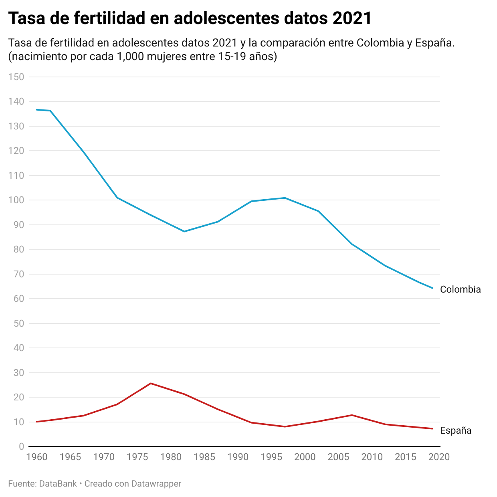
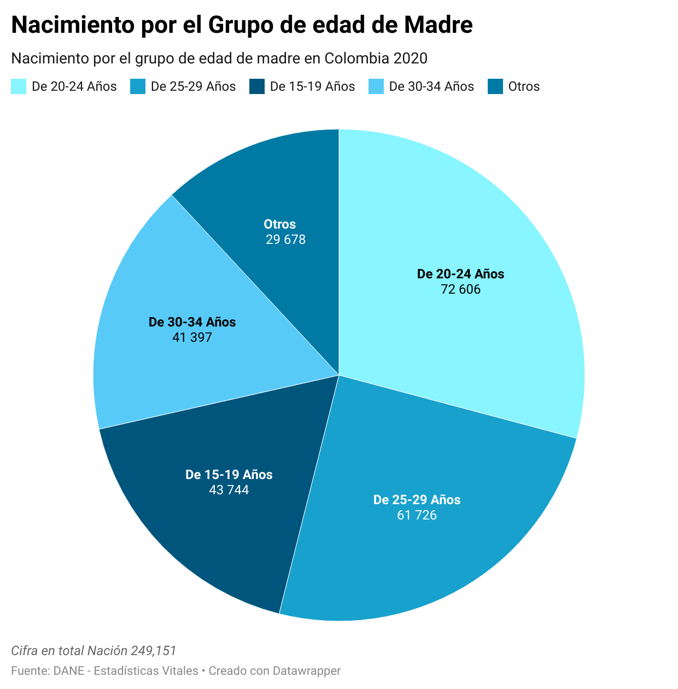
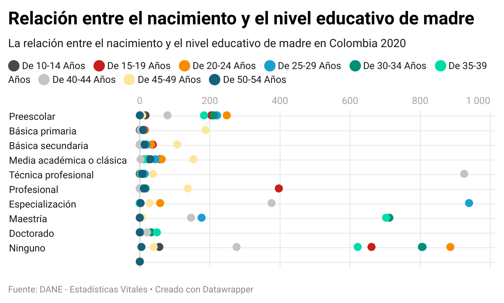

## ¡Hola! Bienvenid@s a mi página
 
Aquí se encuentran las actividades dirigidas de la asignatura Periodismo de datos II.

 
 

# Actividad Dirigida 1
 

# Las visualizaciones más interesantes de 2021
 
Hoy en día, todo el mundo se ha convertido en un mundo digital y de datos. El periodismo de datos también ha evaluado como desarrollo de la profesión como fruto de la época. 
Aparte de recopilar y analizar los datos, la visualización de los datos son una parte imprescindible para la profesión de periodismo de datos. 

El siguiente, son las visualización que me ha parecido más interesantes de 2021.

## España, único país con un 30% de los jóvenes sin empleo

El sábado pasado, vi una noticia en Instagram, en el que dice que España es el único país en la Unión Europea y el mundo, con un 30% de los jóvenes sin empleo. 

La visualización fue muy profesional y directo, con las palabras como indicator en la parte arriba-izquierda, los lectores se pueden entender fácilmente sin ver los textos escritos en la noticia. 

Se muestra en un mapa co diferentes colores indicando diferentes datos de paros en los deferentes países en Europa y otros continentes. La cifra de España es 6 veces que la de Alemania. Es decir, los jóvenes menos que 24 años que no tienen empleo son 6 veces  que Alemania. 

## La visualización de cifra de coronavirus y como se proponga hecho por EEUU

También me surgió la visualización de los datos de infectados de coronavirus en todo el mundo publicado por EEUU, me parece super profesional y vanguardia, y el tema de la análisis era muy ajuste al tiempo que todo el mundo ponía mucha atención a la pandemia. 

En la misma publicación, también explicaba cómo propongaba el coronavirus por los movimientos de los infectados, en un pequeño vídeo hecho de la tecnología 3D. 

Fue una gran publicación, para la carrera profesional de periodismo de datos, también para el mundo y las personas. La gente se puede entender perfectamente sin leer nada textos escritos. 

Lo que es más importante, la gente podría estar más consciente en la protección y la seguridad de salud enfrente a la pandemia. 

### Redes sociales como una canal de visualización

Los dos noticias mencionados en el texto han aplicado unas herramientas muy adecuados y buenos para su tema de noticias, por lo tanto me han dejado una impresión en la cabeza.

Las herramientas para visualizar los datos son imprescindibles, y  sin ninguna duda, son muy importantes para la profesión tanto las analistas de datos como periodistas de datos.

Aparte de las herramientas de visualización, dónde publican también es muy importante. Los redes sociales podrían ser una canal de visualización para el periodismo de datos. Desde mi punto de vista, los redes sociales también es una parte de la visualización. 

Los redes sociales cada día están más conectado con nuestra vida diaria, juegan un papel cada día más importante como una canal de comunicación. Y me parece los redes sociales son el canal ideal de visualización de periodismo de datos.

Por ejemplo, las publicaciones en Instagram, fotos con un buen diseño gráfico, integradas con las noticias escritas de textos cortos, y el uso de la historia en el Instagram para las noticias, es una forma super bien para el periodismo de datos. 

 
 
# Actividad Dirigida 2
 
# La visualización de datos en la noticia *el paro juvenil español*

## Sobre el web 
La URL de la noticia [ El paro juvenil se enquista: España es el único país europeo que no consigue bajar del 30%](https://www.elmundo.es/economia/macroeconomia/2021/11/10/618a7c0321efa0ca218b45d7.html) no es muy conveniente ni para recordar ni para compartir, debido a tener una serie de números y letras super largos; pero como es un artículo del periódico *ElMundo*, a  la gente le compra, a pesar de que la URL es muy largo, la gente pincha en enlace al ver *elmundo* que está ubicado en la primera posición. 

*ElMundo* es un periódico español prestigioso, así que la usabilidad de la web es muy accesible y universal, y la validación de los estándares de la web es fiable. 

También tiene un buen diseño del web, el típico tres columnas. Pero a mí me parece que la columna derecha para las publicidades es demasiado ancha, por eso veo un poco estrecho la columna del artículo. 

## Sobre el artículo 
Me parece que el título de artículo *[El paro juvenil se enquista: España es el único país europeo que no consigue bajar del 30%],* llama mucha atención al público, y despierta la **curiosidad** de las personas para que quieran ver el contenido.

La estructura del contenido del artículo es profesional, el contenido es informativo usando un lenguaje dinámica, así que los lectores pueden leer fácilmente y rápidamente.

Tanto el gráfico y el texto del artículo, adecua a la estructura de la web.
## Sobre la visualización de datos 

Antes de empezar el artículo, empieza con un gráfico de barra para mostrar los datos del paro juvenil visualmente de los países europeos, los lectores pueden entender el mensaje principal sobre este artículo en unos segundos. 

Usa diferentes colores en el gráfico para diferentes niveles de datos, eso facilita contener información para los lectores. 

El siguiente ha utilizado el mapa como la visualización de datos, con diferentes colores expresando diferentes niveles de datos, añadiendo **indicadores de cada color** como elementos de composición, para facilitar la compresión de los lectores.

La visualización con mapa me parece super chulo, desde mi punto de vista, la vista es muy agradable **con buen diseño**, el uso de diferentes colores facilita la combinación de **la análisis y la visualización**, y se aparece las información en cuanto mueve el ratón a cada país en el mapa.

España en el color **naranja profunda** presente un porcentaje del paro juvenil **muy alto**; Portugal, Italia y Grecia en el color **naranja claro**, significan que su porcentaje del paro juvenil también es **alto**, pero *más bajo que lo de España;* Alemania en el color **azul profundo**, muestra que su porcentaje del paro juvenil es **muy bajo**.

### A través de la visualización  
La razón de que elegí este artículo es porque la visualización de datos es excelente, además hizo la visualización en **las redes sociales como canal de visualización.**

Por otra parte, en mi opinión, tanto los artículos como la visualización de datos, solo ofrece una información para los lectores, los lectores deben **reflexionar** después de contener la información.

El contenido de este artículo refleja un problema social de España, a través de la visualización, los lectores pueden **pensar, discutir y proponer soluciones.** 

Fuente:
Daniel Viaña, *ElMundo*, 11 de noviembre de 2021, https://www.elmundo.es/economia/macroeconomia/2021/11/10/618a7c0321efa0ca218b45d7.html 

 
 

# Actividad Dirigida 3
 
# AD3 y justificación

## La visualización del gráfico de actividad-dirigida-3

En primer lugar, presento la visualización del gráfico lo que realicé con la herramienta Datawrapper: 

### Explicaciones de la elección del gráfico

Elegí este gráfico porque se combina muy bien la cantidad de los tweets y los candidatos, ya que es un base de datos complicados juntos con otro dato que es la fecha; Utilicé diferentes colores para diferenciar los cuatro diferentes candidatos para que la visualización que sea más directa.

Realicé este gráfico a través de la herramienta Datawrapper, subí el archivo de datos de formato csv. después de limpiar los datos con Open Refine.

#### Primer paso:subir el archivo de dato de formato csv. 

#### Segundo paso: elegir el gráfico adecuado 

#### Tercer paso: cambiar algunos ajustes

En este caso, he cambiado el *custom range* de Vertical axis, que es [0 - 10,000,000].
Luego, he cambiado el color de la visualización para que cuatro diferenes colores presentan los cuatro candidatos distintos. 

## La limpieza con Open Refine
### Al siguiente es la justificación de la operación de Open Refine

El archivo csv que subí al Datawrapper, hice una limpieza de datos previamente con el Open Refine. 

#### Las transformaciones 
He tranforamdo la colomba de fecha según: editar celdas - transformaciones comunes - a fecha
Hice ligual con los numeros de tweets, según: editar celdas - transformaciones comunes - a número

#### Fitro y Transponer columnas
Luego añadí el fitro, compruebé los datos y transponer/crear columnas de cuatro candidatos.

#### Renombrar la faceta: 
Y después, renombré las facetas según: editar colomnas - renombrar esta columna 

 
 

# Actividad Dirigida 4
 

# El embarazo de adolescentes en Colombia 

**Los embarazos de adolescentes en Colombia** son un problema social. De acuerdo con la definición de la [Organización Mundial de la Salud](https://www.who.int/es/health-topics/adolescent-health#tab=tab_1) la edad de la adolescencia está comprendida **entre los 10 y los 19 años**. Analizaremos la situación de los embarazos en el rango de edad **entre 15 y 19 años**, aunque no hay que obviar que **1.721 niñas** de entre **10 y 14 años** quedaron embarazadas en el año 2020.

## Contraste respecto a España
Hasta el 28 de octubre de 2021 la tasa de **fertilidad en adolescentes para Colombia** ha sido de 64.313, según los [datos correspondientes a 2019](https://databank.bancomundial.org/reports.aspx?source=2&series=SP.ADO.TFRT&country=COL) del [Banco Mundial](https://www.bancomundial.org/es/home) Mientras tanto, la cifra de **España es 72.558** (nacimientos por cada 1.000 mujeres entre **15 y 19** años de edad).

### El siguiente se encuentra el gráfico de la taza de fertilidad 

 

En Colombia, desde 1960 la tasa de fertilidad en adolescentes (aunque con un leve repunte en los años 90) ha bajado constantemente. A pesar de ello, los valores siguen resultando excesivos si los comparamos con los de España: la diferencia es enorme, y puede llegar a ser **10 veces superior.**

 

## Comparativa por edades

Según los datos del [Departamento Administrativo Nacional de Estadística de Colombia](https://www.dane.gov.co/index.php/estadisticas-por-tema/salud/nacimientos-y-defunciones/nacimientos/nacimientos-2020) en el año 2020 el número de nacimientos fue de 512.185 en total. De entre los cuales, **1.721** fueron de mujeres con edades entre *10 y 14 años*, y **43.744** de *15 a 19 años*.

### El siguiente se muestra el gráfico de los nacimientos por grupo de edad en Colombia de 2020:

 

El porcentaje en edades de **15 a 19 años** fue del *17,6%*, el de **10 a 14 años** fue del *0,7%*, y el porcentaje del embarazo en adolescentes, del **18,3%.**

Con respecto a **los embarazos en las edades entre 15 y 19 años**, hemos analizado la situación de las madres, tanto residencial como a **nivel educativo**. Una gran parte de ellas reside en zonas rurales, y además no han recibido una educación suficiente.

 

Este otro gráfico muestra que de entre las mujeres de 15 a 19 años, el 17,49% solo han recibido **educación preescolar**; el 25,17% han recibido **educación básica primaria**; el 33,75% han recibido **educación básica secundaria**; el 15,91% no han recibido *ningún educación*; solo el 2,48% han recibido **educación tecnológica profesional**; apenas el 0,71% han recibido **educación profesional**; y *nadie ha alcanzado una educación especializada ni tampoco un máster.*

Es evidente que las mujeres que quedan embarazadas a edades tempranas no logran un alto nivel formativo, y podríamos imaginar que *el nivel educativo de la madre y el embarazo en adolescentes es **inversamente proporcional.*

## Razones y consecuencias

“El embarazo en adolescentes es un **problema social**, con consecuencias tales como: *conflictos familiares, abandono escolar, cambio de proyectos vitales, discriminación, matrimonio servil o a temprana edad, reducción de ingresos y pobreza.”*

[Unicef](https://www.unicef.org), por su parte, señala que este aumento de embarazos adolescentes y de menores de edad puede estar directamente relacionado con la pandemia que vive el mundo.

Una de las razones principales del embarazo en adolescentes es **la falta de educación, información y orientación sobre la sexualidad.** No reciben información desde los colegios ni los familiares por ser tabúes, no tienen suficientes conocimientos básicos sobre la sexualidad, no toman medidas anticonceptivas o adecuadas y no son conscientes de que el embarazo temprano podría afectar a su futuro.

Deben tener en cuenta que las consecuencias de los embarazos son muchas e irreparables en algunas ocasiones, siempre hay un impacto muy grande tanto para el desarrollo personal como el social. Una serie de problemas como la salud, el riesgo vital para las mujeres en cuanto dan a luz, enfermedades infecciosas, la falta de atención y educación de los niños nacidos, etc.

La **educación de la sexualidad** para los adolescentes ya es un tema importante, necesario y urgente en el país. Por lo tanto, el gobierno, las organizaciones o las fundaciones deberían asumir la responsabilidad de fomentarla.

 
 
 

Fuente:
 
Databank, La taza de fertilidad en adolescentes en Colombia, mayo de 2021
 
https://datos.bancomundial.org/indicator/SP.ADO.TFRT
 
DANE-Esdatística vital, Nacimientos 2020 - Preliminar, 2021
 
https://www.dane.gov.co/index.php/estadisticas-por-tema/salud/nacimientos-y-defunciones/nacimientos/nacimientos-2020

 
